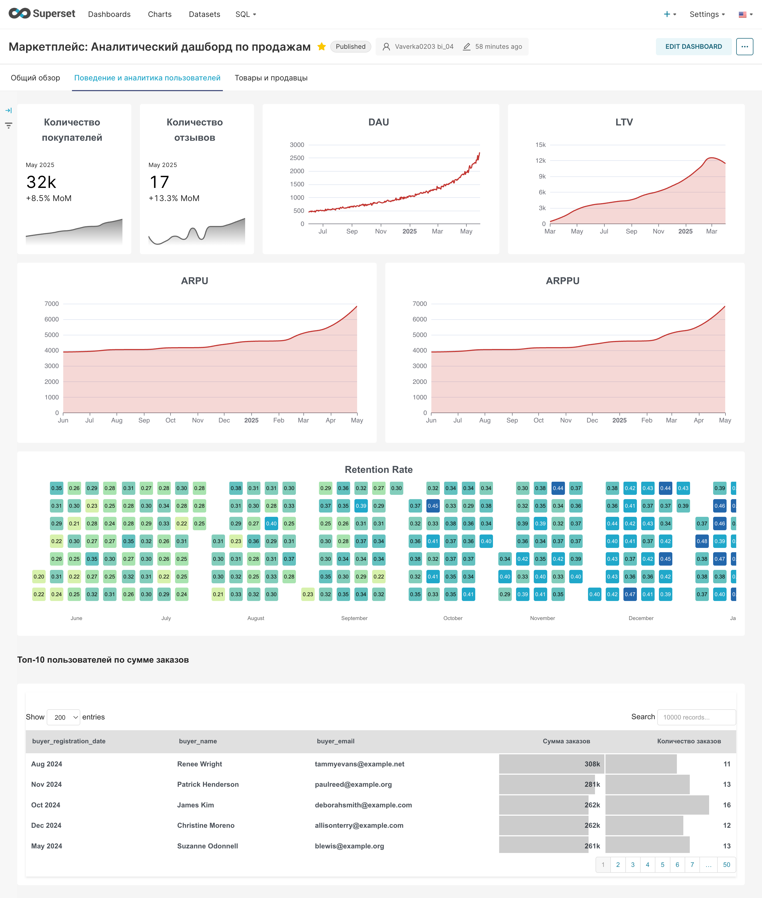

# Анализ продаж и пользователей маркетплейса
 
## Цель проекта
Быстрая оценка и контроль ключевых показателей для повышения эффективности продаж, оптимизации ассортимента и удержания пользователей.

## Описание проекта
В проекте проведён анализ данных маркетплейса с построением интерактивного дашборда в Superset.  
Работа включала подготовку данных, исследовательский анализ, формирование ключевых метрик и визуализацию результатов. 

## Визуализация проекта

### Общий обзор

### Поведение пользователей

### Товары и продавцы

Проект решает бизнес-задачи:
- оперативный контроль выручки, заказов и среднего чека,
- сегментация покупателей и продавцов,
- оценка качества товаров через рейтинги и отзывы,
- анализ поведения пользователей (DAU, LTV, Retention).

Выводы и ценность для бизнеса:
- руководство получает инструмент для мониторинга продаж в реальном времени,  
- маркетинг видит динамику конверсии и эффективность категорий,  
- продуктовая команда понимает активность и удержание пользователей.  

## Описание данных
Исследование проводится на данных, включающих информацию о категориях товаров, заказах и их позициях, каталоге продуктов, транзакциях (платежах и возвратах), отзывах пользователей, а также данных о покупателях и продавцах.

##  Используемый стек/методы
Python (Pandas, NumPy, Matplotlib, Seaborn), Apache Superset, Miro, Google Docs/Sheets, исследовательский анализ данных (EDA), когортный анализ, анализ пользовательской активности, визуализация данных. 

## Результаты исследования
- Составлена документация по проекту (ТЗ, пользовательская инструкция, макет в Miro).  
- Данные предварительно обработаны и проверены.  
- Построен аналитический дашборд в Superset с тремя вкладками:  
Общий обзор:(выручка, заказы, средний чек, конверсия, динамика).  
Поведение и аналитика пользователей: (DAU, LTV, Retention, ARPU).  
Товары и продавцы: (рейтинги, топы по заказам и продажам, детализация).  

