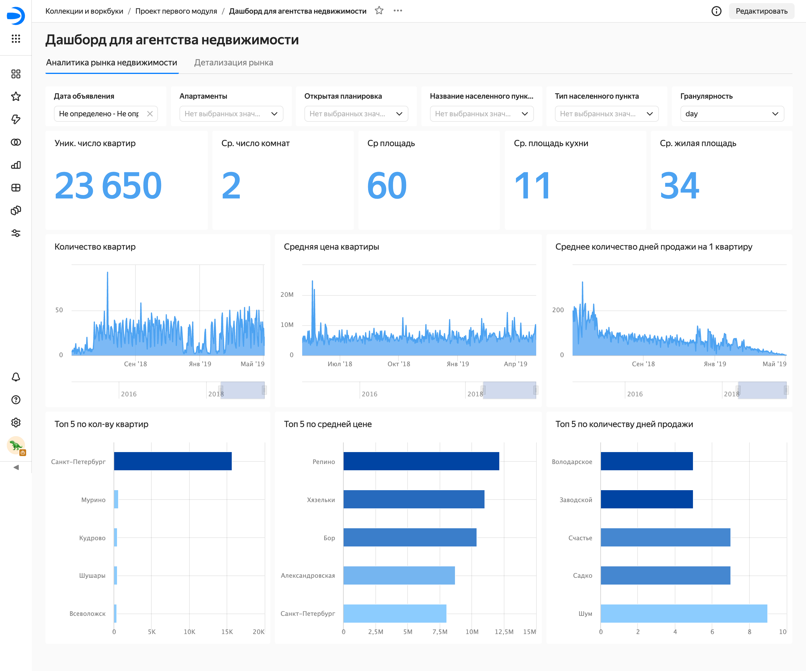
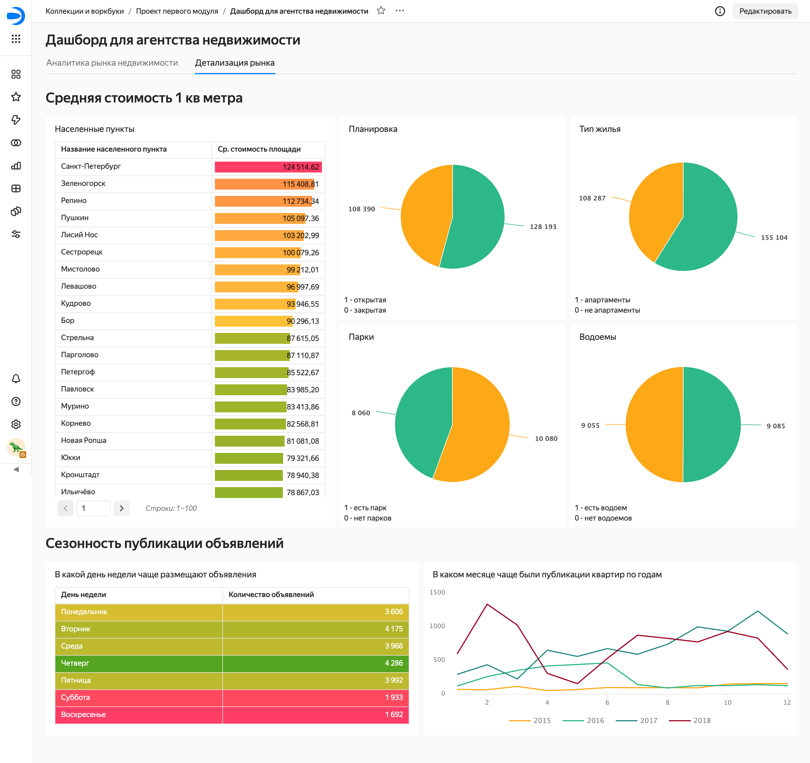

# Анализ рынка недвижимости

## Цель проекта  
Определить наиболее привлекательные сегменты рынка недвижимости Санкт-Петербурга и Ленинградской области, выявить сезонные тенденции и создать аналитический инструмент для принятия бизнес-решений агентством недвижимости, планирующим выход на новый регион.

## Описание проекта  
В проекте проведён анализ архивных данных сервиса Яндекс Недвижимость за несколько лет, содержащих объявления о продаже квартир в Санкт-Петербурге и Ленинградской области.  
На основе результатов построен интерактивный дашборд в Yandex DataLens, который обеспечивает наглядное представление ключевых метрик рынка. Он позволяет отслеживать динамику публикаций и снятия объявлений, анализировать стоимость квадратного метра, площадь и характеристики квартир. Кроме того, дашборд помогает выявлять сезонные тенденции и сравнивать регионы по уровню спроса, ценам и срокам продажи.

## Визуализация проекта  

### Аналитика рынка недвижимости  

### Детализация рынка и сезонность  

Проект решает бизнес-задачи: 
- Определить наиболее привлекательные сегменты недвижимости по сроку активности объявлений.  
- Выявить сезонные тенденции на рынке и активные периоды публикации/снятия объявлений.  
- Сравнить структуру и стоимость рынка Санкт-Петербурга и Ленинградской области.  
- Определить населённые пункты с наибольшей активностью и скоростью продаж.

Выводы и ценность для бизнеса:  
- Агентство получает инструмент для оценки ликвидности, сезонности и ценообразования на рынке недвижимости.  
- Руководство может планировать маркетинговые кампании и периоды выхода на рынок.  
- Позволяет определять рентабельные сегменты недвижимости.
- Проект позволил выявить ключевые тенденции рынка недвижимости Санкт-Петербурга и Ленинградской области, включая различия в ценах, площади и сроках продажи объектов.
Полученные инсайты помогают агентству планировать маркетинговые кампании, определять приоритетные сегменты рынка и повышать эффективность продаж.

## Описание данных  
Использованы архивные данные сервиса Яндекс Недвижимость за несколько лет, включающие объявления о продаже квартир (идентификаторы, даты публикации и снятия, сроки активности), характеристики объектов (площадь, количество комнат, высота потолков, наличие парков/водоёмов), ценовые данные (средняя цена, средняя стоимость за м²), географические параметры (населённый пункт, тип жилья).

## Используемый стек/методы  
SQL (PostgreSQL), Yandex DataLens, визуализация данных, исследовательский анализ данных.

## Результаты исследования  
- Определено техническое задание (ТЗ) на основе бизнес-запроса заказчика.  
- Проведена предобработка и исследовательский анализ данных (очистка от выбросов, проверка типов, заполнение пропусков).  
- Сформулированы и решены ad hoc задачи по ключевым направлениям: анализ сроков активности, сезонности и региональных различий.  
- Разработаны SQL-запросы для расчёта метрик и подготовки агрегированных данных.  
- Построен интерактивный дашборд в Yandex DataLens с фильтрами и показателями активности рынка.  
- Подготовлена аналитическая записка с выводами и рекомендациями для заказчика.    

