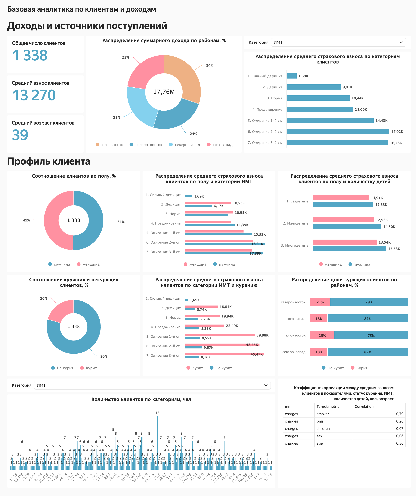

# Аналитика клиентов и доходов страховой компании

## Цель проекта  
Разработать единый интерактивный дашборд для руководства страховой компании, который позволяет изучать профиль клиентов и анализировать источники доходов, чтобы определять перспективные направления расширения бизнеса, принимать обоснованные решения для стратегического развития страховых продуктов и проводить планирование на месяц, квартал или год.

## Описание проекта  
В проекте собраны и обработаны данные страховой компании, включающие возраст, пол, индекс массы тела (ИМТ), наличие детей, привычку курить и размер страхового взноса клиентов. На основе этих данных создан интерактивный дашборд в Yandex DataLens, который позволяет анализировать структуру доходов и профиль клиентов по ключевым признакам — полу, возрасту, детям, курению и ИМТ, а также выявлять закономерности между этими характеристиками и размером страховых взносов.

## Визуализация проекта

Проект решает бизнес-задачи:
- сформировать единый обзорный инструмент для стратегического планирования.  
- оценивать структуру доходов и источники поступлений по регионам. 
- анализировать портрет клиентов и выделять целевые аудитории по полу, возрасту, курению, ИМТ и наличию детей.  
- выявлять факторы, влияющие на страховые взносы, чтобы оптимизировать тарифную политику.  
- поддерживать управленческие решения по развитию продуктов и маркетинговых стратегий.

Выводы и ценность для бизнеса:
- Руководители компании получили интерактивный инструмент мониторинга клиентской базы и доходов в реальном времени.  
- Дашборд позволяет оперативно выявлять прибыльные и рискованные сегменты клиентов.  
- Аналитика помогает оптимизировать страховые тарифы, повышая рентабельность без потери клиентов.  
- Визуализация профиля клиентов облегчает маркетинговое планирование и разработку персонализированных страховых программ.
- Анализ показал, что размер страховых взносов зависит от личных характеристик клиентов — пола, возраста, ИМТ, наличия детей и привычки курить.
Отдельные группы, такие как курящие клиенты и лица с избыточным весом, вносят более высокие страховые платежи, что отражает влияние образа жизни на стоимость страхования.

## Описание данных  
В проекте использовались данные, содержащие информацию о клиентах страховой компании: возраст, пол, индекс массы тела, количество детей, факт курения, регион проживания и размер страхового взноса.
Для более детального анализа были созданы дополнительные вычисляемые поля — возрастные категории, группы по ИМТ, тип семьи и признак курения, что позволило сегментировать клиентов и выявить ключевые зависимости между их характеристиками и страховыми взносами.

## Используемый стек / методы  
Yandex DataLens, SQL, Miro, исследовательский анализ данных (EDA), корреляционный анализ, визуализация данных.
  
## Результаты исследования  
- Составлено техническое задание на основе требований заказчика и создан макет дашборда в Miro.  
- Подготовлены и преобразованы данные, созданы вычисляемые поля.  
- Разработан дашборд с разделением на два блока: "Доходы и источники поступлений" и "Профиль клиента".  
- Визуализированы ключевые показатели: средний страховой взнос, возраст, структура доходов,  
  соотношение по полу, курению, детям и категориям ИМТ.  
- Получен наглядный инструмент для стратегического анализа клиентской базы.  

